# Layout catalog

Generated by `scripts/build_thumbnails.py --template sample`. Each image shows the layout filled with its `example` content.

## Kind: `title`

### `title`: Title (dark)

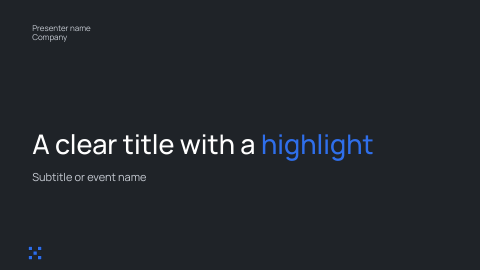

Dark cover with a large title, a subtitle and the presenter at the top.

- Use when: First slide of a deck.
- Source: slide 2
- Fields: `title`*, `subtitle`, `presenter`
- Also selected for kind: `cover`

## Kind: `section`

### `section`: Section opener

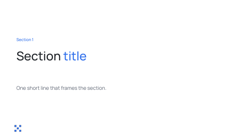

Light slide with a small label, a large title and a short subline.

- Use when: Start a new section of the talk.
- Source: slide 3
- Fields: `label`, `title`*, `subtitle`

## Kind: `statement`

### `statement`: Statement

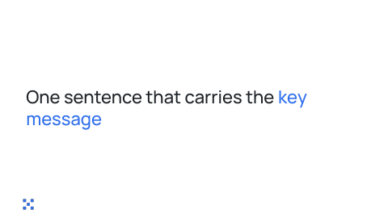

One large sentence with a highlight, vertically centred.

- Use when: A key message, transition or provocation.
- Source: slide 4
- Fields: `title`*

## Kind: `agenda`

### `agenda`: Agenda

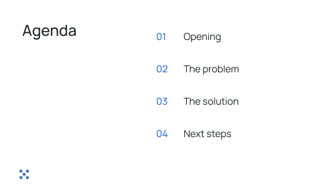

Title at the left, numbered list of up to four items at the right.

- Use when: Outline of the talk with up to four short items.
- Source: slide 5
- Fields: `title`
- Items: 1 to 4, fields `label`
- Also selected for kind: `steps`

## Kind: `text`

### `text`: Title and text

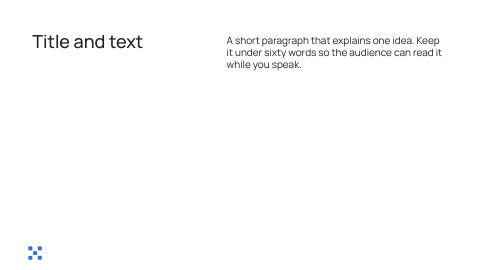

Title at the left, one paragraph block at the right.

- Use when: A single idea explained in a short paragraph.
- Source: slide 6
- Fields: `title`*, `body`*

## Kind: `rows`

### `rows-3`: Three titled rows

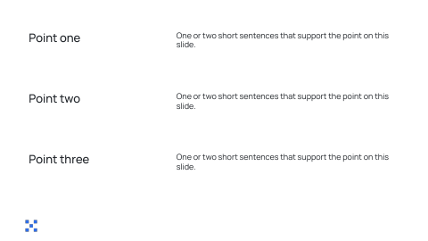

Up to three rows. Each row has a title at the left and a paragraph at the right.

- Use when: Two or three points that each need a paragraph.
- Source: slide 7
- Fields: none
- Items: 1 to 3, fields `title`, `body`
- Also selected for kind: `points`

## Kind: `cards`

### `cards-3`: Three cards

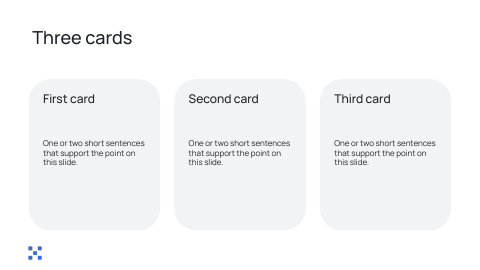

Headline and three grey cards, each with a title and a paragraph.

- Use when: Exactly three points that each need a sentence or two.
- Source: slide 8
- Fields: `title`*
- Items: 3 to 3, fields `title`, `body`
- Also selected for kind: `points`

## Kind: `text-image`

### `text-image`: Text with image

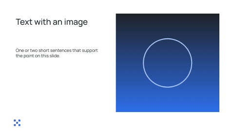

Title and paragraph at the left, image at the right.

- Use when: A point supported by a photo or screenshot.
- Source: slide 9
- Fields: `title`*, `body`, `image`*

## Kind: `image`

### `images-2`: Two images

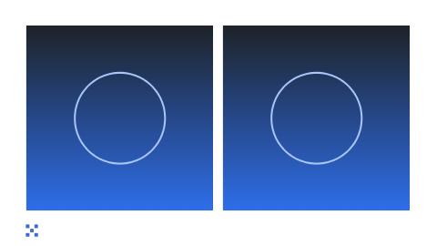

Two framed images side by side.

- Use when: Two photos or screenshots with margins.
- Source: slide 10
- Fields: none
- Items: 2 to 2, fields `image`

## Kind: `stat`

### `big-number`: Big number

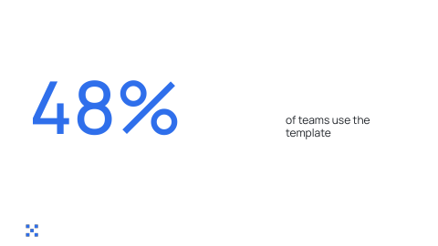

Very large number at the left and a label at the right.

- Use when: One key metric.
- Source: slide 11
- Fields: `value`*, `label`*

## Kind: `stats`

### `stats-3`: Three stats

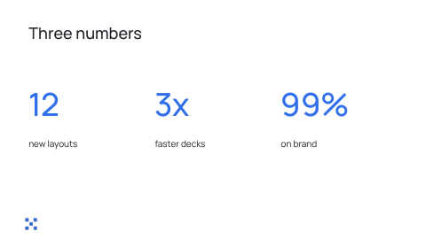

Headline, then three accent numbers with a short label under each.

- Use when: Two or three supporting metrics.
- Source: slide 12
- Fields: `title`*
- Items: 2 to 3, fields `value`, `label`

## Kind: `chart`

### `bar-chart`: Bar chart (percentages)

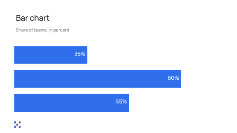

Two or three horizontal bars sized to their percentage, with the value inside each bar.

- Use when: Compare two or three percentages.
- Source: slide 13
- Fields: `title`*, `subtitle`
- Items: 2 to 3, fields `value`

## Kind: `quote`

### `quote`: Quote

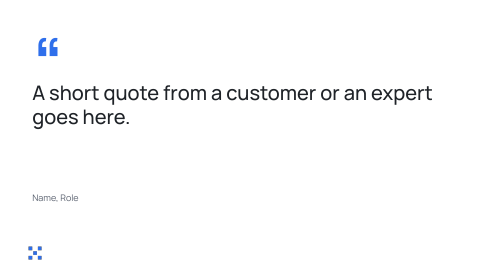

Large accent quote mark, large quote text and the attribution below.

- Use when: A customer or expert quote.
- Source: slide 14
- Fields: `quote`*, `attribution`

## Kind: `timeline`

### `timeline`: Timeline

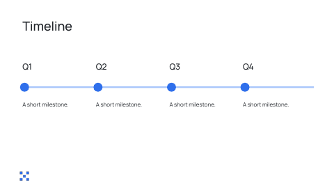

Title and up to four milestones on a horizontal line.

- Use when: Two to four dated milestones.
- Source: slide 15
- Fields: `title`
- Items: 2 to 4, fields `label`, `body`

## Kind: `code`

### `code`: Code sample

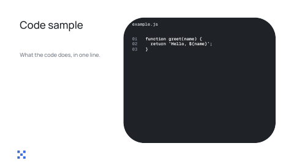

Title and subtitle at the left, dark code window with file name and line numbers at the right.

- Use when: Show a short code or JSON snippet (up to ~20 lines).
- Source: slide 16
- Fields: `title`*, `subtitle`, `filename`, `code`*

## Kind: `closing`

### `closing`: Thank you

Dark slide with a large centred closing line.

- Use when: Last slide.
- Source: slide 17
- Fields: `title`

## Kind: `text`

### `title-content`: Title and content

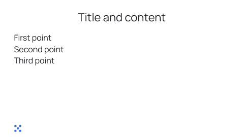

Title at the top and a text block below.

- Use when: A title and several short paragraphs or bullets.
- Source: master layout 0
- Fields: `title`*, `body`*

## Kind: `section`

### `section-header`: Section header

Plain section header with a title and a short line.

- Use when: A quiet section break.
- Source: master layout 1
- Fields: `title`*, `subtitle`

## Kind: `image`

### `image-caption`: Image with caption

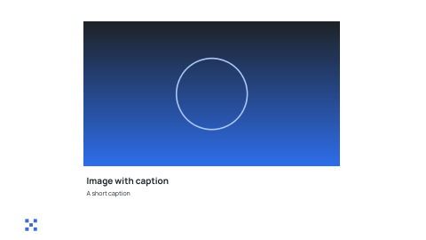

Title, one large image and a caption.

- Use when: One image that needs a title and a caption.
- Source: master layout 3
- Fields: `title`*, `image`*, `caption`
